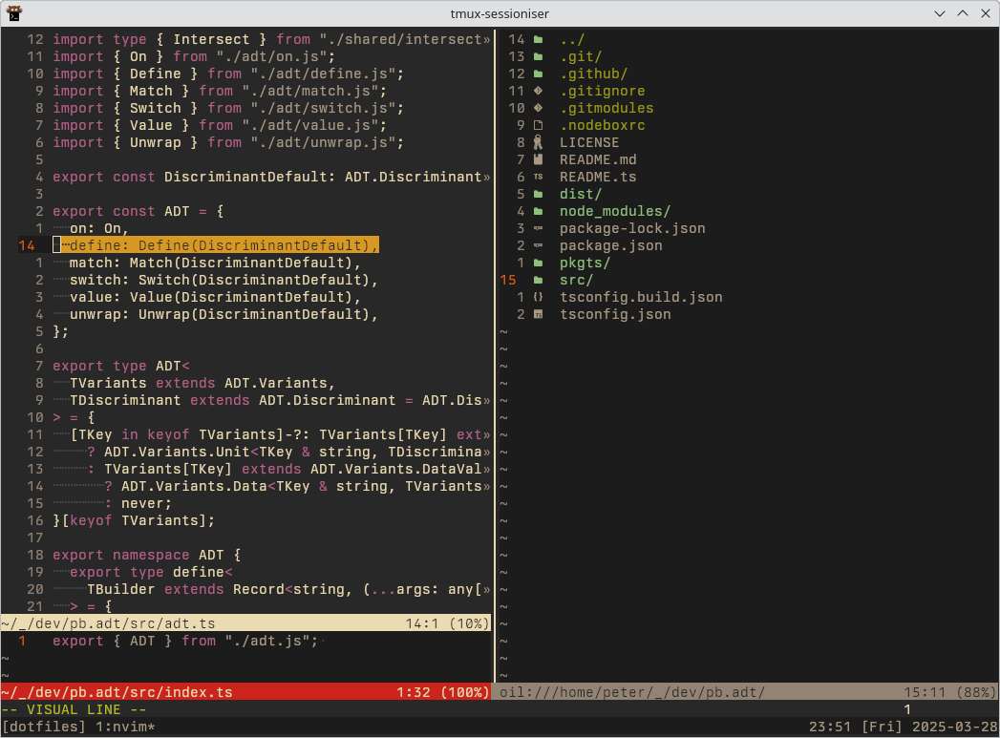

# dotfiles

- [`./kitty`](./kitty) ([kitty](https://github.com/kovidgoyal/kitty))
  - using [gruvbox](https://github.com/morhetz/gruvbox) theme
- [`./zsh`](./zsh) ([zsh](https://www.zsh.org/))
  - using [oh-my-zsh](https://github.com/ohmyzsh/ohmyzsh) for plugins
- [`./tmux`](./tmux) ([tmux](https://github.com/tmux/tmux))
- [`./nvim`](./nvim) ([neovim](https://neovim.io/))
  - using custom [monochrome](./nvim/colors/mono.vim) theme
  - using [lazy](https://github.com/folke/lazy.nvim) for plugins
  - using [oil](https://github.com/stevearc/oil.nvim) for file navigation/manipulation
  - using [mason](https://github.com/williamboman/mason.nvim) for plugins' external dependencies
  - using [telescope](https://github.com/nvim-telescope/telescope.nvim) for fuzzy search
  - using [lspconfig](https://github.com/neovim/nvim-lspconfig) for lsp configuration
  - using [typescript-tools](https://github.com/pmizio/typescript-tools.nvim) for advanced typescript lsp support
  - ... see `./nvim/lua/plugins` for more!
- [`./lazygit`](./lazygit/) ([lazygit](https://github.com/jesseduffield/lazygit))

## OS

### `./hosts/home.fedora`

- `./links.sh`, apply all symlinks (alias `host-links`)
- `./update.sh`, update system and all installed packages (alias `host-update`)
- `./packages.sh`, install all specified packages (alias `host-packages`)

## Preview

